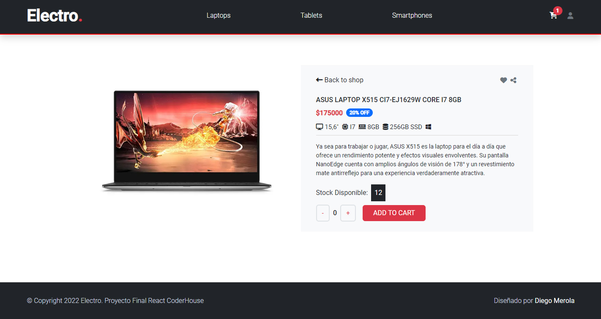

# Proyecto E-Commerce React

Proyecto Final E-Commerce para el curso de React Js en Coderhouse. Programado en React y creado con CRA.

## Screenshots



- Al ingresar al sitio el usuario puede navegar por diferentes categorias, ver los productos e ir a sus detalles.
- Desde el detalle de producto se ve el titulo, descripción, foto, precio y stock. Para ingresar un producto al carrito se debe seleccionar la cantidad y clickear en ‘add to cart‘.
- Una vez que el carrito tenga al menos un producto, se visualiza un
  listado compacto de la orden con el precio total. Los productos seleccionados se pueden eliminar de a uno o todos juntos.
- Al clickear ‘checkout’ se guarda en la base de datos una orden que
  tiene todos los productos con: id, precio, cantidad y fecha. Luego se muestra el número de orden.

## Comenzando 🚀

- Deberás Forkear este proyecto si quieres tener una copia en tu propio repositorio de GitHub.

- Si lo que deseas es tener una copia en tu computador local, debes bajarte el archivo ZIP.

## Instalación 🔧

Instalar "my-project" con npm:

```bash
  npm install my-project
  cd my-project
  npm start
```

## Deployment 📦

## Construido con 🛠️

- HTML
- CSS
- Bootstrap
- Javascript
- React
- React-router-dom
- Firebase
- Sweetalert 2
- Font awesome
- Google Fonts

## Autor ✒️

- **Diego Merola** - Front End Developer - [diegomerola](https://github.com/diegomerola)

## Expresiones de Gratitud 🎁

- **Alex Marin Mendez** - _Profesor CoderHouse_ - [alexmarinmendez](https://github.com/alexmarinmendez)
